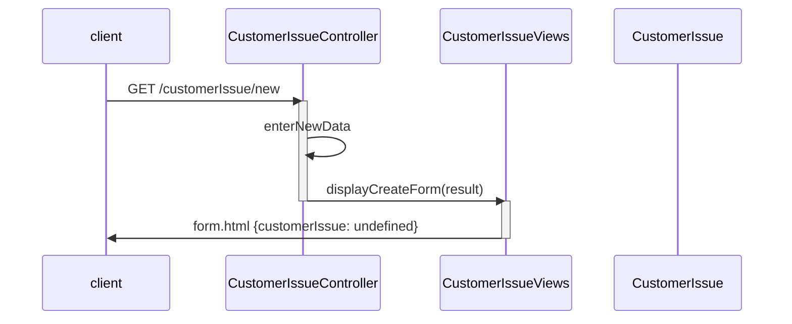
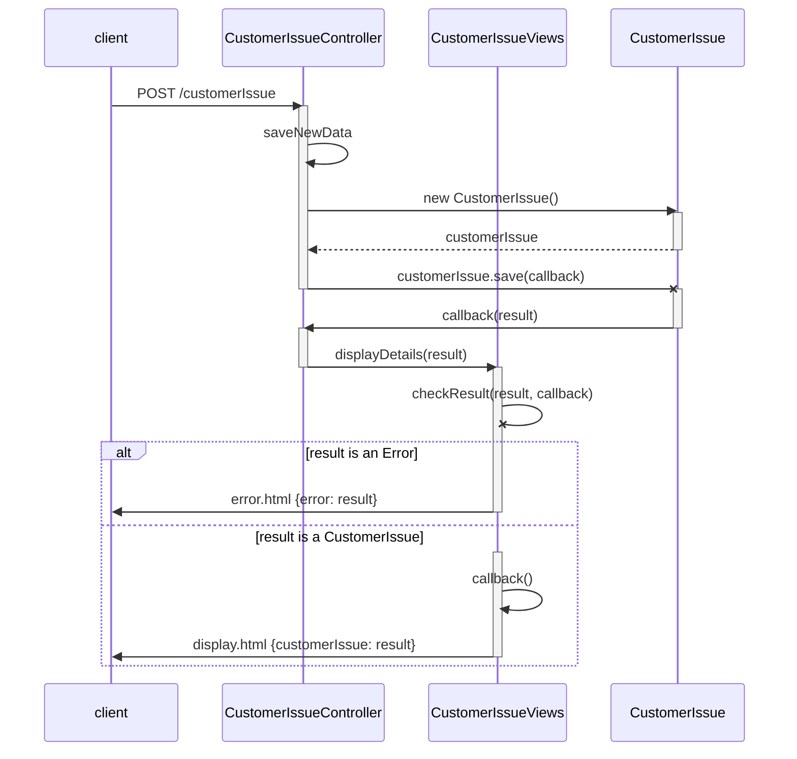
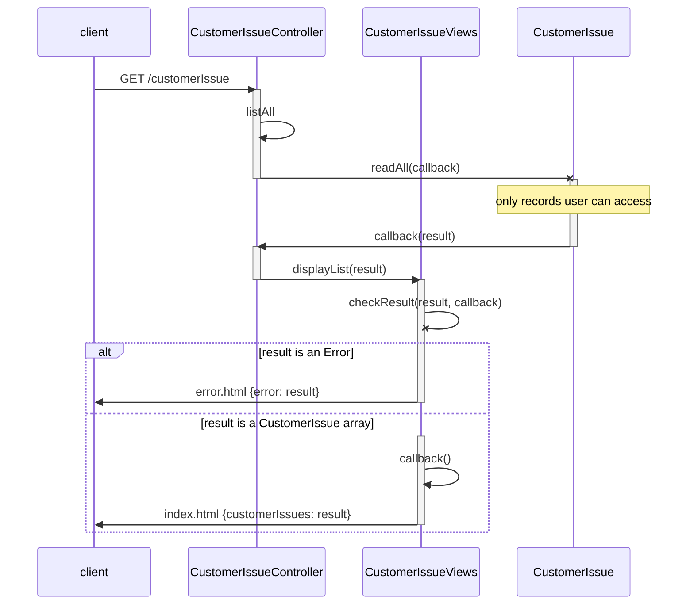
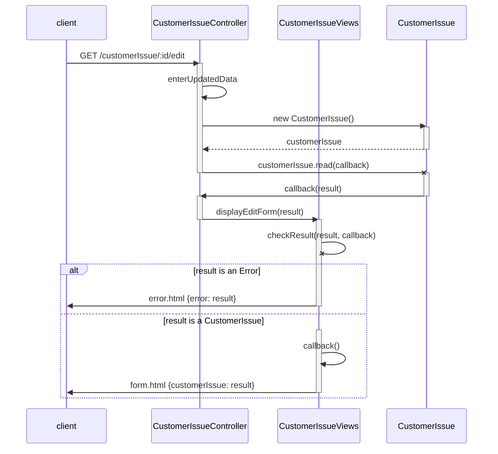
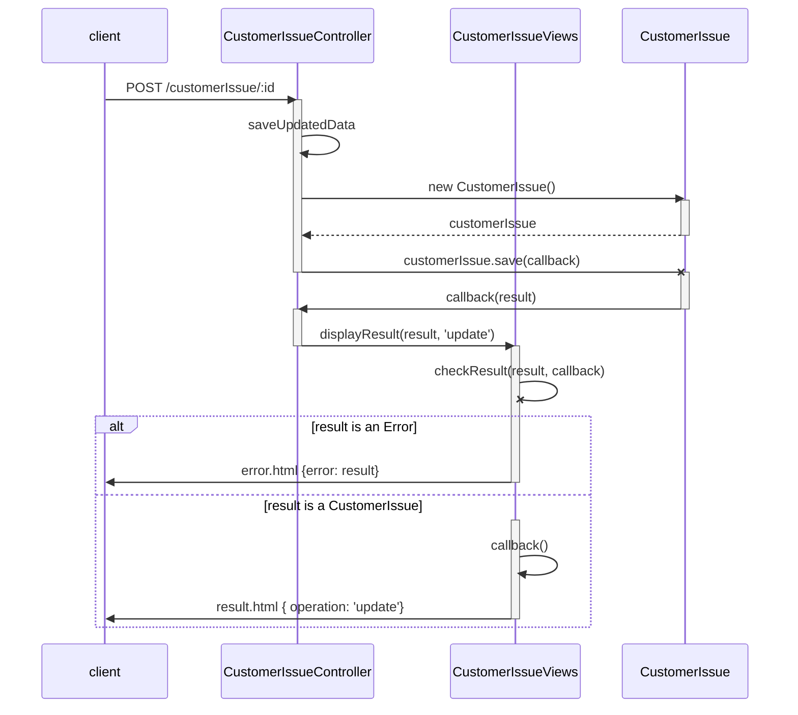
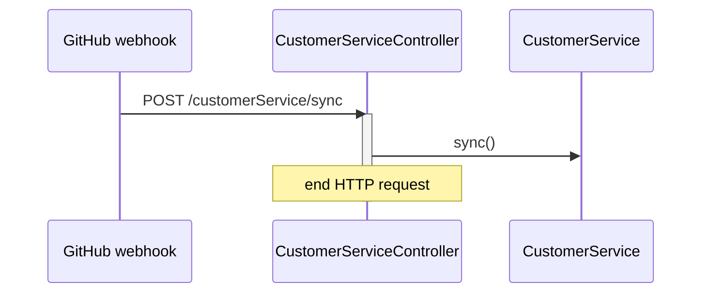

# `customerIssue` Service

TODO: investigate splitting webhook into two webhooks: one for Issue changes (we would ignore everything except relevant labels), and one for comments. Also, check this document for consistency with `workflow.md`.

Handles issues/requests/inquiries submitted to the DevOps organization by customers or other public, non-staff users.

The data managed by this service will be stored in two places: the application's `mysql` database, and in GitHub Issues (plus comments on those Issues). The Issues will probably be stored in a single GitHub repo, but we will design to allow for different ones.

The goal is to simultaneously 

1. allow customers or other public, non-staff users to use a custom Web app to submit requests/issues, post new comments on those issues, and see all comments on those issues; and
2. allow staff to use GitHub to see these issues, post new comments, and see all comments.

## `mysql` Database design

### Table: `issue`

- `pk` (autonumber)
- `contactName`
- `anonymous` (was this created by anonymous user? (not logged in))
- `datetime` (auto capture)
- `subject`
- `emergency` (is this an emergency?; may refine this to severity levels)
- `ghRepoName` (name of the github repo where there is corresponding Issue; this will probably always be the same)
- `ghIssueNumber` (Issue number in github)

### Table: `comment`

- `pk` (autonumber)
- `issueFK` foreign key: PK of associated `issue` record
- `datetime` (auto capture)
- `body`

When an `issue` record is created, an associated `comment` record will also be created. (Because (I think) GitHub Issues do not have a "body"; they have comments, with the first comment having a kind of special role.)

### Table: `statusHistory`

- `pk` (autonumber)
- `issueFK` foreign key: PK of associated `issue` record
- `datetime` (auto capture)
- `newStatus` Valid values are values of `refStatus.statusCode`

This table stores a history of every "status change" of every customer issue that is tracked.  When an `issue` record is created, an associated `statusHistory` record will also be created, with the `newStatus` field set to the minimum `statusCode` value in the `refStatus` table. This indicates that the new issue is in the first stage of the customer service process.

### Table: `refStatus`

This "reference" or lookup table will not be maintained by application code.

| `statusCode` | `statusLabel`       |
| ------------ | ------------------- |
| 10           | 'Request received'  |
| 20           | 'Problem confirmed' |
| 30           | 'Fix defined'       |
| 40           | 'Fix implemented'   |
| 50           | 'Fix confirmed'     |

There is nothing magic about the code numbers, but their order is important, as the status represents a sequence of steps in the customer service process. Using non-sequential numbers allows the possibility of creating new steps in the sequence, in between the others.

The GitHub repo(s) used to store customer issues should define Issue labels corresponding to the `statusLabel` values in this table.

## JavaScript classes

One model class will handle all three (non-reference) database tables. The `CustomerIssue` class structure will mirror the `issue` table structure, with additional properties for:
- comments (an array of all associated `comment` records; these can be created as JS object literals)
- status (`newStatus` value from most recent associated `statusHistory` record)

In the `save()` method, after a new `issue` table record is created, the corresponding data must also be written  via the GitHub API. That is, a new GitHub Issue must be created, with a label corresponding to its status, indicating that it is in the first step of the customer service process. GitHub will (I think) automatically create a comment on the Issue, activating the webhook described below.

`CustomerIssue` will include a `sync()` method, activated by the webhook described below. It would be extremely difficult to synchronize modifications to existing issues and comments, so the app will not attempt this. In practice, this means that staff should use GitHub only to *add comments* to these Issues, not to *modify* the Issues or their comments.

In order to modify an Issue's status with respect to the customer service sequence, the following approach will be used. GitHub Issue labels will be used to indicate the Issue's current step or status; this allows easy searching in GitHub. However, staff should treat these status-related labels as "read-only" in GitHub. To change an Issue's status, staff may create a new Issue comment that contains the name of a valid new status (the next status in the process, or any earlier status). The `sync()` method will automatically adjust labels accordingly when a valid status change is submitted via comment; invalid status changes will be ignored.

Here is pseudocode for the `sync()` method.

```
// Ignore webhook calls for GH Issues that are not Customer Issues
if the GH Issue is not in the mysql `issue` table then 
	stop

// Record new comments on Customer Issues
if there is a new GH Issue comment that is not in the mysql `comment` table then
	if the commment contains a status label then
		if the label is invalid then
			log it
			stop
		else
			create a statusHistory record
	add a record to the `comment` table
```

## REST API

### `GET /customerIssue/new`

Get a Web form to create a new issue. Links for this request will be provided to customers and added to the footer that appears on all `dewv.net` pages.



### `POST /customerIssue`

Form submission to create a new issue.


### `GET /customerIssue`

Retrieve a list of all issues in the `mysql` database that the user has permission to access. (Access filtering will be added later)



### `GET /customerIssue/:id/edit`

Get a form to edit an issue identified by `:id`. (That is our application's `pk`/`id`, no the GH Issue number.) The list of issues will include links (pencil icons) for each issue to trigger this edit request.



### `POST /customerIssue/:id`

Form submission for editing the issue identified by `:id`.



### `POST /customerIssue/sync`

This is triggered by a GitHub webhook. GitHub will make this request to our app when any Issue comment is created, updated, or deleted in any repo(s) that we choose. This allows our app to synchronize `mysql` data with the new changes.




These [UML](https://en.wikipedia.org/wiki/Unified_Modeling_Language) [sequence diagrams](https://en.wikipedia.org/wiki/Sequence_diagram) are written in a language called [mermaid](https://mermaidjs.github.io/). Each is a block of mermaid code, embedded in a pair of "code fences" in this markdown file.

Here are two ways to view and edit this file.

1. On your local machine with [`typora`](typora.io) installed, open this file. `typora` has features to render and edit these files. Use a `git` client to sync changes to GitHub. Or for one-time edits, copy/paste or upload at github.com.
2. Online. github.com supports online editing of markdown files, but does not handle the embedded mermaid content as typora does. You can copy a diagram's source code (everything between a pair of mermaid code fences), and paste into [this online editor](https://mermaidjs.github.io/mermaid-live-editor). The editor will render the diagram and allow you to make changes. If you want to keep those changes, you will need to carefully paste the altered mermaid code back into the code fences in the markdown file at github.com.

